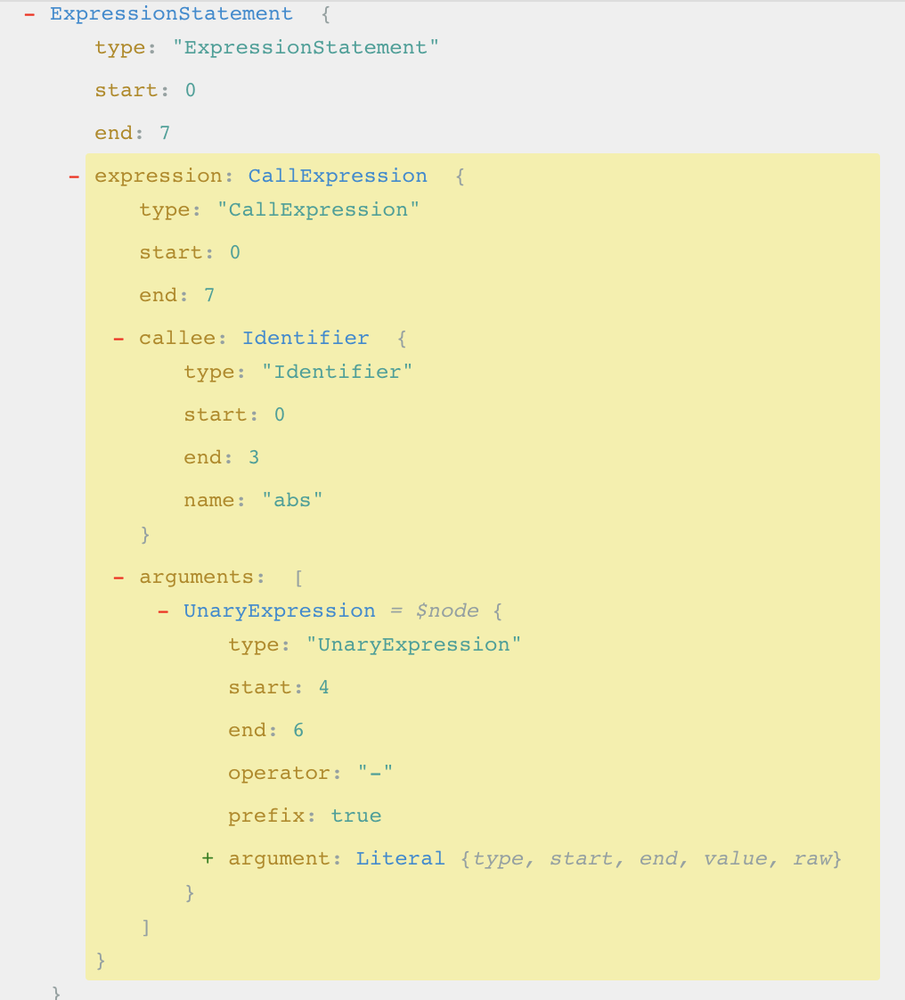

# babel-ast-compiler

note book of ast

## Table of Contents

- [babel简介](#babel-instruct)
- [babel parser](#babel-parser)
- [babel transform](#babel-transform)
- [babel generate](#babel-generate)
- [babel conclusion](#babel-concurrency)

## babel简介

1.基本概念

    babel是一个js编译器(Babel is a JavaScript compiler.)，对于编译器的基本原理以及基本架构，可以通过参考文献[4]进行详细了解；

2.babel运行原理

    用babel对代码进行处理（eg es6转es5或者jsx转换）主要可以划分为3步：parse, transform and generate;

## parse（parser）

1. parse的主要工作
    使用解析器（parser）对输入的源代码字符串进行解析并生成初始AST（File.prototype.parse）;通常把源码解析成为抽象语法树的步骤可以分为两部：词法分析（Lexical Analysis）和语法分析（Syntactic Analysis）

1.1 词法分析

    根据tokenizer or lexer（分词器）将源码（raw code）分割成符号集（tokens）；tokens是一个数组，数组项为小对象，这些对象描述了相对独立的语法，它们可能是数字，标签，标点，操作符等任何符号；

1.2 语法分析

    把词法分析得到的tokens重新格式化为Abstract Syntax Tree, ast描述了每一部分语法以及相互关系; ast本质是一个深度嵌套对象，这个对象包含足够的信息以及很容易处理；

```javascript  
    * For the following syntax:
    *
    *   (add 2 (subtract 4 2))
    *
    * Tokens might look something like this:
    *
    *   [
    *     { type: 'paren',  value: '('        },
    *     { type: 'name',   value: 'add'      },
    *     { type: 'number', value: '2'        },
    *     { type: 'paren',  value: '('        },
    *     { type: 'name',   value: 'subtract' },
    *     { type: 'number', value: '4'        },
    *     { type: 'number', value: '2'        },
    *     { type: 'paren',  value: ')'        },
    *     { type: 'paren',  value: ')'        },
    *   ]
    *
    * And an Abstract Syntax Tree (AST) might look like this:
    *
    *   {
    *     type: 'Program',
    *     body: [{
    *       type: 'CallExpression',
    *       name: 'add',
    *       params: [{
    *         type: 'NumberLiteral',
    *         value: '2',
    *       }, {
    *         type: 'CallExpression',
    *         name: 'subtract',
    *         params: [{
    *           type: 'NumberLiteral',
    *           value: '4',
    *         }, {
    *           type: 'NumberLiteral',
    *           value: '2',
    *         }]
    *       }]
    *     }]
    *   }
    */
```  

2  关于ast
   对于开发者来说，源码可读性更高，但是站在计算机的角度，ast更易于计算机的处理，所有的ast根节点都是Program节点;ast各种节点信息对于我们编写babel插件来说必不可少，关于各种节点类型信息的详细说明见：[core Babylon AST node types](https://github.com/babel/babylon/blob/master/ast/spec.md)

    对于下面一段简单的js代码片段:

```javascript
    let name = 'jack';
    function printTips() {
        tips.forEach((tip, i) => console.log(`Tip ${i}:` + tip));
    }
```

    转换成ast树的结构为:

    

3.ast的构建

3.1 使用babel-types从零开始构建；
        可以使用babel-traverse对AST进行遍历，并解析出整个树的path，通过挂载的 metadataVisitor 读取对应的元信息；

3.2 使用babel parse从已有的js代码开始构建；

3.3 使用babel template从已有的模版替换；

## transform

    对code parse生成的ast进行修改，它不仅可以通过ast在同一种语言进行转换，还可以生成另一门语言；ast包括很多相似的元素，这些元素
    是一个个节点，包括type等属性，我们通常称之为ast node;

```javascript
* //ast node example
* We can have a node for a "NumberLiteral":
*
*   {
*     type: 'NumberLiteral',
*     value: '2',
*   }
*
* Or maybe a node for a "CallExpression":
*
*   {
*     type: 'CallExpression',
*     name: 'subtract',
*     params: [...nested nodes go here...],
*   }
```

1 transform的用法
    遍历AST树并应用各transformers（plugin)生成变换后的AST树, babel中最核心的是babel-core，它向外暴露出babel.transform 接口。

```javascript
    babelCore.transform(output, {
        plugins: [
            require("babel-plugin-transform-object-rest-spread"),
            unEscapeJsescPlugin
        ],
        babelrc: false
    }).code
```

2 Traversal

    为了路由到指定的节点进行指定操作，需要遍历ast的节点，babel-traverse会以深度优先的法则来遍历树的节点，例如；

```javascript
    *   {
    *     type: 'Program',
    *     body: [{
    *       type: 'CallExpression',
    *       name: 'add',
    *       params: [{
    *         type: 'NumberLiteral',
    *         value: '2'
    *       }, {
    *         type: 'CallExpression',
    *         name: 'subtract',
    *         params: [{
    *           type: 'NumberLiteral',
    *           value: '4'
    *         }, {
    *           type: 'NumberLiteral',
    *           value: '2'
    *         }]
    *       }]
    *     }]
    *   }
    *
    * So for the above AST we would go:
    *
    *   1. Program - Starting at the top level of the AST
    *   2. CallExpression (add) - Moving to the first element of the Program's body
    *   3. NumberLiteral (2) - Moving to the first element of CallExpression's params
    *   4. CallExpression (subtract) - Moving to the second element of CallExpression's params
    *   5. NumberLiteral (4) - Moving to the first element of CallExpression's params
    *   6. NumberLiteral (2) - Moving to the second element of CallExpression's params
```

    如果我们想直接操作ast, 而不是创建新的独立ast, 我们只需要visit每一个节点即可，而不需要了解（all sorts of abstractions）

```javascript
    * Visitors
    * --------
    *
    * The basic idea here is that we are going to create a “visitor” object that
    * has methods that will accept different node types.
    *
    *   var visitor = {
    *     NumberLiteral() {},
    *     CallExpression() {},
    *   };
    *
    * When we traverse our AST, we will call the methods on this visitor whenever we
    * "enter" a node of a matching type.
    *
    * In order to make this useful we will also pass the node and a reference to
    * the parent node.
    *
    *   var visitor = {
    *     NumberLiteral(node, parent) {},
    *     CallExpression(node, parent) {},
    *   };
    *
    * However, there also exists the possibility of calling things on "exit". Imagine
    * our tree structure from before in list form:
    *
    *   - Program
    *     - CallExpression
    *       - NumberLiteral
    *       - CallExpression
    *         - NumberLiteral
    *         - NumberLiteral
    *
    * As we traverse down, we're going to reach branches with dead ends. As we
    * finish each branch of the tree we "exit" it. So going down the tree we
    * "enter" each node, and going back up we "exit".
    *
    *   -> Program (enter)
    *     -> CallExpression (enter)
    *       -> Number Literal (enter)
    *       <- Number Literal (exit)
    *       -> Call Expression (enter)
    *          -> Number Literal (enter)
    *          <- Number Literal (exit)
    *          -> Number Literal (enter)
    *          <- Number Literal (exit)
    *       <- CallExpression (exit)
    *     <- CallExpression (exit)
    *   <- Program (exit)
    *
    * In order to support that, the final form of our visitor will look like this:
    *
    *   var visitor = {
    *     NumberLiteral: {
    *       enter(node, parent) {},
    *       exit(node, parent) {},
    *     }
    *   };
    */
```

3 编写一个babel plugins

3.1 遍历ast tree的节点

    在编写ast插件的时候，通常需要遍历ast tree的每一个节点，babel提供了babel-traverse来对树状结构进行遍历；对于ast tree上的每一个分支我们都会先向下遍历走到尽头，然后向上遍历退出遍历过的节点寻找下一个分支;

(1) visitor对象

    Babel提供我们一个visitor对象供我们获取ast tree里具体节点来进行访问;eg.比如我们想访问if else语句生成的节点，我们可以在visitor里指定获取它所对应的节点：其实这种遍历会让每个节点都会被访问两次，一次是向下遍历代表进入（enter），一次是向上退出（exit）。因此实际上每个节点都会有 enter和exit方法;

```javascirpt  
    const visitor = {
        IfStatement() {
            enter() {
                console.log("enter if sentence");
            },
            exit() {}
        }
    };
```  

(2) path

    visitor模式中我们对节点的访问实际上是对节点路径的访问，在这个模式中我们一般把path当作参数传入节点选择器中。path表示两个节点之间的连接，通过这个对象我们可以访问到节点、父节点以及进行一系列跟节点操作相关的方法（类似 DOM 的操作）。

```javascript
    var babel = require('babel-core');
    var t = require('babel-types');

    const code = `d = a + b + c`;
    const visitor = {
        Identifier(path) {
            console.log(path.node.name);  // d a b c
        }
    };
    const result = babel.transform(code, {
        plugins: [{
            visitor: visitor
        }]
    });
```

(3) 节点替换

    编写一个简单的Babel插件。把下面的abs函数换成原生支持的Math.abs来进行调用；

```javascript
    function abs(number) {
        if (number >= 0) {  
            return number;  
        } else {
            return -number;
        }
    }
```

    可以先通过（在线ast转换平台）[https://astexplorer.net/]查看一下abs(-8)对应的ast tree的结构，如下所示：

    

    可以看到表达式语句下面的 expression 主要是函数调用表达式（CallExpression），因此我们也需要创建一个函数调用表达式,可以借助 babel-types 里提供的一些方法帮我们快速创建。

```javascript
    // 创建函数调用表达式
    t.CallExpression(
    // 创建对象属性引用
        t.MemberExpression(t.identifier('Math'), t.identifier('abs')),
        // 原始节点函数调用参数
        path.node.arguments
    )
```

```javascript
    var babel = require('babel-core');
    var t = require('babel-types');

    const code = `abs(-8);`;
    const visitor = {
        CallExpression(path) { //函数调用
            if (path.node.callee.name !== 'abs') return; //函数名不为abs，不处理；
            console.log("path==========>", path);
            path.replaceWith(t.CallExpression( //使用babel-types创建CallExpression类型节点，并替换已有节点；
                t.MemberExpression(t.identifier('Math'), t.identifier('abs')),
                path.node.arguments
            ));
        }
    };
    const result = babel.transform(code, {
        plugins: [{
            visitor: visitor
        }]
    });
    // Math.abs(-8)
    console.log("result.code====>", result.code);
```

**Note**: [更多使用和创建插件详见](https://github.com/jamiebuilds/babel-handbook)

## generate

    代码生成器根据ast生成编译之后的产物的有几种方式，有些编译器会重用之前的tokens，有些编译会创建新的代码表示，但是大部分的场景是：
使用transform阶段生成的ast来生成最终编译之后的产物；

1 利用babel-generator将AST树输出为转码后的代码字符串;

```javascript
    const generator = require('babel-generator').default;
    code = generator(code).code;
```

## babel conclusion

    babel是一个js编译器；

参考文档:

1. [babel-types](https://babeljs.io/docs/en/next/babel-types.html)
2. [babel-parse](https://astexplorer.net/)
3. [babel-handbook](https://github.com/jamiebuilds/babel-handbook)
4. [the-super-tiny-compiler](https://github.com/jamiebuilds/the-super-tiny-compiler/blob/master/the-super-tiny-compiler.js)